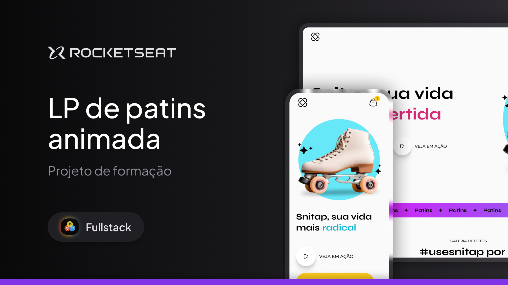

<h1 align="center"> Projeto Snitap Patins </h1>

  <a href="#-tecnologias">Tecnologias</a>&nbsp;&nbsp;&nbsp;|&nbsp;&nbsp;&nbsp;
  <a href="#-projeto">Projeto</a>&nbsp;&nbsp;&nbsp;|&nbsp;&nbsp;&nbsp;
  <a href="#-layout">Layout</a>&nbsp;&nbsp;&nbsp;|&nbsp;&nbsp;&nbsp;
  <a href="#memo-licença">Licença</a>

  

 

## 🚀 Tecnologias

Esse projeto foi desenvolvido com as seguintes tecnologias:

- HTML e CSS
- Git e Github
- Figma

## 💻 Projeto

NO projeto Snitap é uma Landing Page responsiva desenvolvida para destacar um patins inovador, utilizando uma abordagem criativa com animações e transições dinâmicas.

Foram implementadas animações com keyframes, transform e animation, aplicadas de maneira estratégica para dar vida aos elementos da página. Cada efeito foi planejado para criar uma experiência interativa e envolvente, como transições suaves em botões, imagens animadas e elementos em destaque ao rolar a página.

O design responsivo garante uma experiência consistente em diferentes dispositivos, enquanto o uso das animações reforça o apelo visual do projeto, equilibrando estética e funcionalidade.

Snitap é um exemplo prático de como técnicas de animação podem transformar uma Landing Page em uma interface interativa e moderna.

## 🔖 Layout

Você pode visualizar o layout do projeto através [DESSE LINK](<https://www.figma.com/design/LXYq1iBnnOqxKSEdfWTEt4/LP-de-patins-animada-(Community)?m=auto&t=9j6XVdr3mRSktHCh-6>). É necessário ter conta no [Figma](https://figma.com) para acessá-lo.

## 🌌 Ver Site

Confira aqui:https://luisfelipets17.github.io/Snitap-Patins/

## 📝 Licença

Esse projeto está sob a licença MIT.

---
